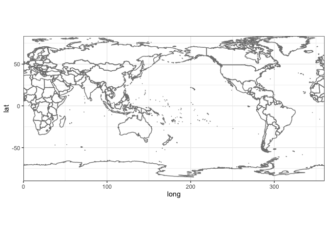
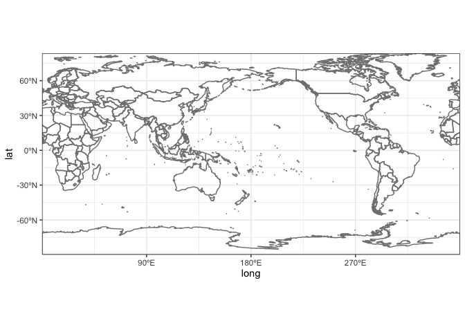

<!-- *Created by [Ka Ming Fung](kamingfung@link.cuhk.edu.hk)* -->

Here is an example of how to plot an Atlantic-centered world map using R and ggplot2. :earth_americas:

```r
library(ggplot2) # for plotting

ggplot() + borders("world2") + coord_fixed(expand = FALSE) + theme_bw()
```

<!-- -->

…and with a bit more informative axes.

```r
library(scales)  # for formatting axes labels

ggplot() + borders("world2") + coord_fixed(expand = FALSE) + theme_bw() +
  scale_x_continuous(breaks = c(90, 180, 270), labels = label_number(suffix = "ºE")) +
  scale_y_continuous(breaks = c(-60, -30, 0, 30, 60), labels = label_number(suffix = "ºN"))
```

<!-- -->

You can then add other geometry objects onto the map.
