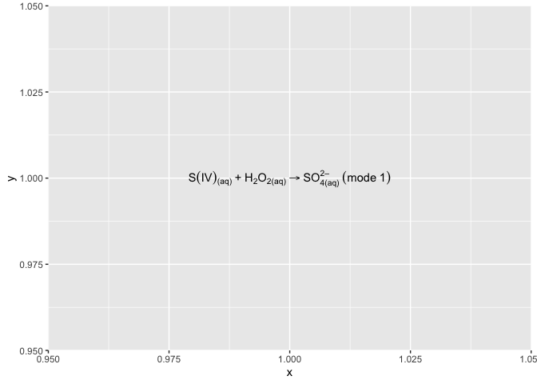

Here is an example showing special characters and formats in ggplot2.

In the following example, we are going to show a chemical reaction in a plot created by "ggplot2". It may seem straightforward but the way R handles it is not. Let's look at the code.

```r
library(ggplot2)  # for plotting

# setting up the base plot
g = ggplot()
g = g + geom_text(aes(x = 1, y = 1, label = 'S(IV)["(aq)"]~"+"~H[2]*O[2*"(aq)"] %->% SO[4*"(aq)"]^"2–"~(mode~1)'), parse = T)

g
```

<!-- -->

In the code example, we try to pass a string defined for "label" into
the "R" basic function "parse" to convert plain text into an "plot.math"
object, i.e., a chemical equation in this example. There are some
strange symbols in the string and they all carry special function -

- round brackets "(" and ")" are quoted so that "parse" considers them
  normal characters.
- "~" and "\*" indicate whether linking characters are separated by a
  space or not, respectively.
- "~" can sometimes be replaced by a space character " " if there is
  no ambiguity for "parse".
- "[" and "]" are used to put the containing characters as a subscript.
- "^" is used for super-scripting, and, to put multiple characters
  into one superscription, we need to quote the characters using
  quotation marks """.
- For an expression with both sub- and superscription, "parse"
  considers them orderly as sub- \> superscription.
- Finally, "%->%" is the arrow symbol, and a list of such special
  equation symbols can be found in [this website of
  plotmath](https://astrostatistics.psu.edu/su07/R/html/grDevices/html/plotmath.html).
