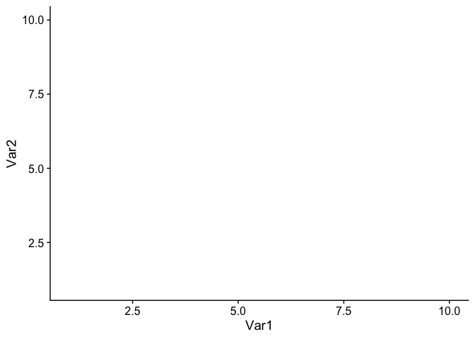
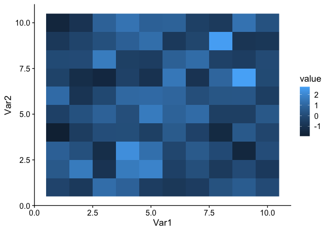
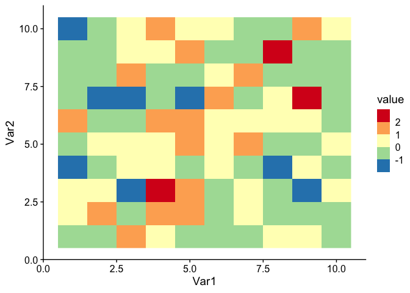
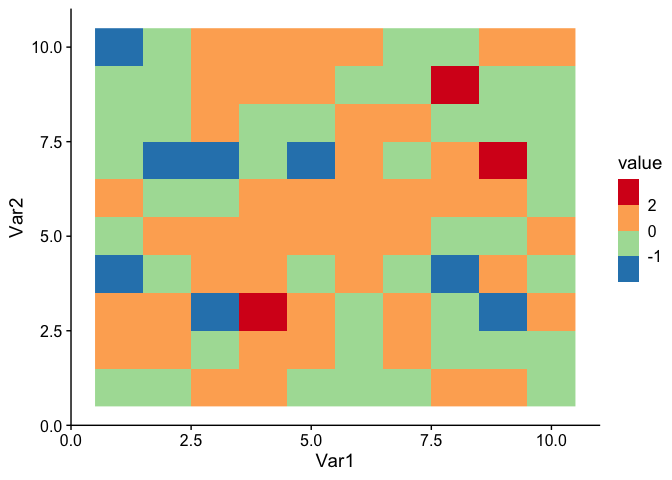
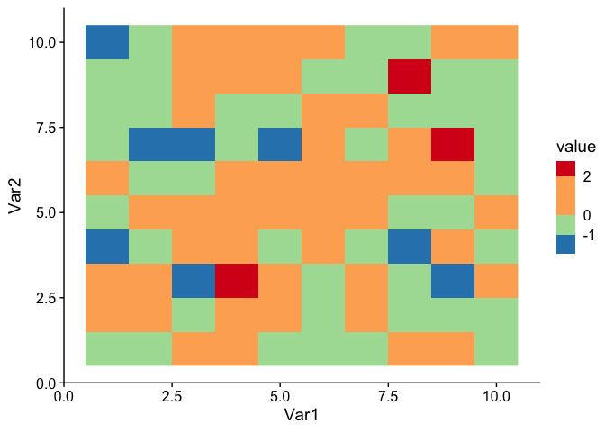

<!-- Created by Ka Ming Fung (<kamingfung@link.cuhk.edu.hk>) -->

This is an example to set up colors in the colorbars in ggplot2.

Let’s start with generating some random data.

``` r
# create a 10-by-10 matrix with random numbers as entries
m = matrix(data = rnorm(n = 100), nrow = 10, ncol = 10)

# converting the matrix into a data frame for ggplot to read
library(reshape2)
df = melt(m)

# showing the first 7 rows of the data frame for illustration
head(x = df, n = 7)
```

    ##   Var1 Var2      value
    ## 1    1    1 -0.2921716
    ## 2    2    1 -0.6998522
    ## 3    3    1  1.2001914
    ## 4    4    1  0.8193078
    ## 5    5    1 -0.5572283
    ## 6    6    1 -0.7793558
    ## 7    7    1 -0.5819304

Time to play with ggplot colorbars (\#nofun).

``` r
library(ggplot2)  # for plotting
library(cowplot)  # for publication friendly ggplot themes

# setting up the base plot
g = ggplot(data = df, mapping = aes(x = Var1, y = Var2)) + theme_cowplot()

g
```

<!-- -->

Showing our data on the plot as a heatmap colors depending on "value".

``` r
# adding "heatmap" using rastered grids
g1 = g + geom_raster(mapping = aes(fill = value)) # for raster plot, "fill" defines the color inside each rectangle
g1
```

<!-- -->

It looks good. Gridboxes with lower values are filled with darker blue,
vice versa. But, people want better. For example, some prefer nicer
colors.

``` r
# adding raster but with better colors
g2 = g1 + scale_fill_distiller(palette = "Spectral")
g2
```

<!-- -->

Some prefer binned colors.

``` r
# adding raster but with binned colors
g2.binned = g1 + scale_fill_fermenter(palette = "Spectral")
g2.binned
```

<!-- -->

Some prefer binned colors with non-uniform breaks.

``` r
# adding raster but with binned colors and customerized breaks
g3 = g1 + scale_fill_fermenter(palette = "Spectral", breaks = c(-1, 0, 2))
g3
```

<!-- -->

Some even prefer non-uniform scales.

``` r
# adding raster but with binned colors and customerized breaks on a non-uniform scale
g4 = g1 + scale_fill_fermenter(palette = "Spectral", breaks = c(-1, 0, 2)) + guides (fill = guide_coloursteps(even.steps = F))
g4
```

<!-- -->

Finally, for some who want to control the limits or ends of the
colorbar. One thing to note: after setting the limit range for the
colorbar, some gridboxes may have out-of-bound (oob) values and to be
treated as "NA". This can be simply avoid by using the "squish" function
under package "scales".

``` r
# adding raster with binned colors and customerized breaks on a non-uniform scale, and control the limits
library(scales)   # for the "squish" function
g5 = g1 + scale_fill_fermenter(palette = "Spectral", breaks = c(-1, 0, 2), limits = c(-2, 3), oob = squish) + guides (fill = guide_coloursteps(even.steps = F, show.limits = T))
g5
```

<!-- -->

<!-- Bonus: if you want to make a fancier interactive map, the package `plotly` would be a good choice. -->

<!-- ```{r, warning=FALSE} -->

<!-- library(plotly) # for drawing interactive plots -->

<!-- p = ggplotly(g5) -->

<!-- p -->

<!-- ``` -->
