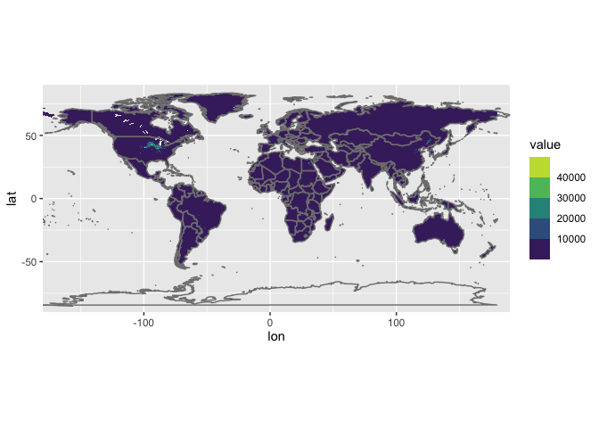
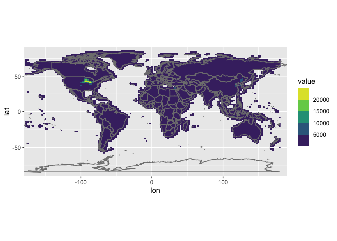

<!-- *Created by [Ka Ming Fung](kamingfung@link.cuhk.edu.hk)* -->

Often, we use observations to validate model simulations. In addition to data quality, a big challenge is that we need to regrid the observations (or model results) to match with its counterpart. :straight_ruler:

In this post, I'll show you how to use the `raster` package to perform a bilinear interpolation on the 5-min-by-5-min data of global maize production.

```r
# ====== loading libraries =====
library(ncdf4)      # for reading nc files
library(raster)     # for resampling
```

    ## Loading required package: sp

```r
library(reshape2)   # for reshaping files
library(tidyverse)  # for tidying up data
```

    ## ── Attaching packages ─────────────────────────────────────────────────────── tidyverse 1.3.0 ──

    ## ✓ ggplot2 3.3.2     ✓ purrr   0.3.4
    ## ✓ tibble  3.0.3     ✓ dplyr   1.0.1
    ## ✓ tidyr   1.1.1     ✓ stringr 1.4.0
    ## ✓ readr   1.3.1     ✓ forcats 0.5.0

    ## ── Conflicts ────────────────────────────────────────────────────────── tidyverse_conflicts() ──
    ## x tidyr::extract() masks raster::extract()
    ## x dplyr::filter()  masks stats::filter()
    ## x dplyr::lag()     masks stats::lag()
    ## x dplyr::select()  masks raster::select()

The dataset we use here is in NetCDF format and can be downloaded [from this link](https://mycuhk-my.sharepoint.com/:u:/g/personal/1155013803_link_cuhk_edu_hk/EUGfT23rRvRBqivuwpOFmSgB0a_wvYCPOpnY8STqYqoCKw?e=JRexEL).

```r
# ====== reading data =====
nc.name = "maize_AreaYieldProduction.nc"

# open the NC file
nc = nc_open(filename = nc.name)

# extract coordinate and value of interest
lon.old = ncvar_get(nc = nc, varid = "longitude")
lat.old = ncvar_get(nc = nc, varid = "latitude")
old.matrix = ncvar_get(nc = nc, varid = "maizeData")[,,6] # <--- picking the 6th layer of data = production of maize. check out the .nc file for details

nc_close(nc)
rm(nc)

# Different data could have different methods to assign values to the matrix (increasing vs decreasing lon)
# I found that the best way to avoid dealing with that is to transform the matrix into a named matrix and then a dataframe, i.e. a list of (lon, lat, and value)
dimnames(old.matrix) = list(lon = lon.old, lat = lat.old)

old.df = melt(old.matrix)

head(old.df)
```

    ##         lon      lat value
    ## 1 -179.9583 89.95833   NaN
    ## 2 -179.8750 89.95833   NaN
    ## 3 -179.7917 89.95833   NaN
    ## 4 -179.7083 89.95833   NaN
    ## 5 -179.6250 89.95833   NaN
    ## 6 -179.5417 89.95833   NaN

Now we have a `dataframe` storing the values. We first convert the `dataframe` into a `raster` object so that we can apply the `resample` function in the `raster` package. Then, we define the solution of the target grid size (usually matching with model).

```r
# ===== regridding =====
# make raster for the old gridded data
r = rasterFromXYZ(old.df)

# define resolution of the new grid
dlat.new = 1.9 # new delta lat
nlat.new = 96  # number of new lat
dlon.new = 2.5 # new delta lon
nlon.new = 144 # number of new lon

# make raster for the new grid
s = raster(nrow = nlat.new, ncol = nlon.new)

# use resample to regridded data
t = resample(r, s, method = "bilinear")
```

Finally, we can convert the `raster` `t` back to a `matrix` or a
`dataframe` for further processing.

```r
# converting the regridded raster back to a named matrix
new.matrix = as.matrix(t)
dimnames(new.matrix) = list(lat = seq(90, -90, length.out = nlat.new),
                   lon = seq(-177.5, 180, by = dlon.new)) # <--- this setting is a bit tricky as lon of -180º = 180º

# or, further, into a dataframe
new.df = melt(new.matrix)

head(new.df)
```

    ##        lat    lon value
    ## 1 90.00000 -177.5    NA
    ## 2 88.10526 -177.5    NA
    ## 3 86.21053 -177.5    NA
    ## 4 84.31579 -177.5    NA
    ## 5 82.42105 -177.5    NA
    ## 6 80.52632 -177.5    NA

Finally, we can compare the original data and the regridded data
visually.

This is what the original data looks like:

```r
# plot the original data to check
old.df %>% ggplot(aes(x = lon, y = lat, fill = value)) +
  geom_raster(interpolate = FALSE) +  # adding heat maps
  scale_fill_viridis_b(na.value = NA ) + # change color
  borders() + # adding country borders
  coord_equal(expand = FALSE) # keeping a nice aspect ratio
```

    ## Warning: Removed 7123007 rows containing missing values (geom_raster).


and the regridded ones:

```r
# then the regridded data
new.df %>% ggplot(aes(x = lon, y = lat, fill = value)) +
  geom_raster(interpolate = FALSE) +  # adding heat maps
  scale_fill_viridis_b(na.value = NA ) + # change color
  borders() + # adding country borders
  coord_equal(expand = FALSE) # keeping a nice aspect ratio
```

    ## Warning: Removed 9010 rows containing missing values (geom_raster).



Done!
