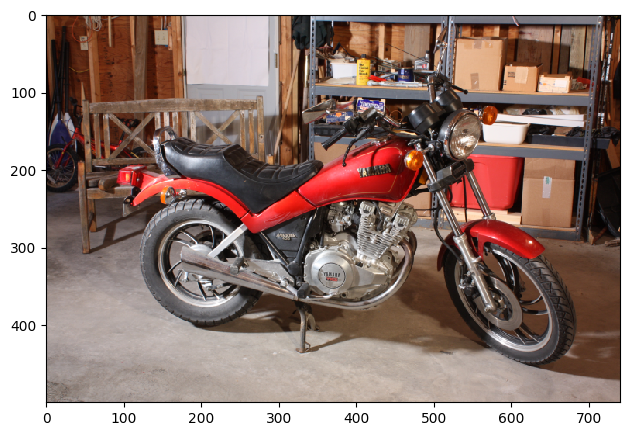
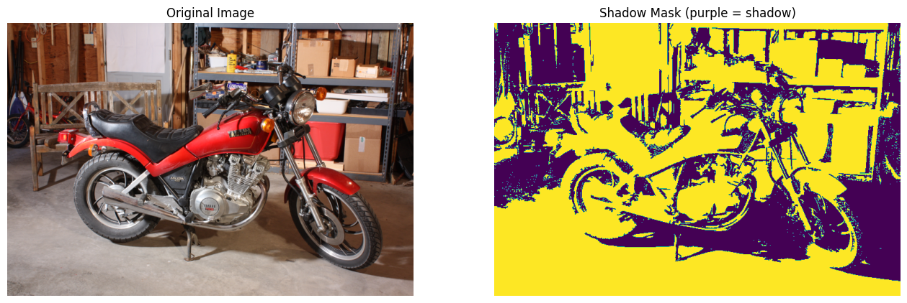

Shadows. They can make photos look dramatic and cool, or they can be a total pain for image editing. :sunglasses: But detecting them? That's actually a super useful skill for understanding the geometry and lighting of a scene.

In this post, I'm going to show you how to hunt down shadows in an image using Python and `scikit-image`. We'll dive into why the HSV (Hue, Saturation, Value) color space is the secret sauce for this task and build a simple pipeline to catch those shadows. :detective:

By the end of this, you'll know:

1. **Color Spaces**: Why RGB isn't always your best friend.
2. **Thresholding**: How to let the computer decide what's "dark" and what's not.
3. **Morphological Operations**: Cleaning up the mess (noise) in your masks.

## Prerequisites

Grab these libraries if you haven't already:

```python
# %pip install numpy scikit-image matplotlib
```

```python
import numpy as np
import skimage
import matplotlib.pyplot as plt
from skimage import filters, morphology, color, io, data
```

## Step 1: Loading a Sample Image

Let's use the classic "stereo motorcycle" image from `scikit-image`. It's got some nice, distinct shadows for us to play with.

```python
image_rgb = data.stereo_motorcycle()[0]

# Display the original image
plt.figure(figsize=(8, 6))
plt.imshow(image_rgb)
plt.title("Original Image")
plt.axis("off")
plt.show()
```



## Step 2: Why HSV?

Most images are stored in RGB (Red, Green, Blue). But here's the thing: in RGB, a shadow makes _everything_ darker—red, green, and blue values all drop. This makes it tough to tell a dark object apart from a shadow.

Enter **HSV (Hue, Saturation, Value)**! :sparkles:

- **Hue**: The actual color (red, blue, etc.).
- **Saturation**: How "intense" the color is.
- **Value (Brightness)**: How light or dark it is.

Shadows mostly mess with the **Value** (making it darker) but leave the **Hue** alone. This is our superpower! We can isolate shadows just by looking for dark areas that still have the right color properties.

```python
# Convert the image to HSV color space
image_hsv = color.rgb2hsv(image_rgb)

# Extract Hue and Value (Brightness) channels
hue = image_hsv[:, :, 0]
brightness = image_hsv[:, :, 2]
```

## Step 3: Thresholding

Now we need to decide: "How dark is a shadow?" Instead of guessing, we'll use **Otsu's method**. It's a smart algorithm that automatically finds the best threshold to separate the foreground from the background.

We'll apply it to both brightness and hue. Shadows are usually:

1. Darker than the rest (Low Brightness).
2. Have a specific hue profile (we'll use a threshold to help separate them).

```python
# Find global threshold on the lightness and hue to detect dark (shadow) regions
brightness_thresh = filters.threshold_otsu(brightness)
hue_thresh = filters.threshold_otsu(hue)

print(f"Brightness Threshold: {brightness_thresh:.2f}")
print(f"Hue Threshold: {hue_thresh:.2f}")
```

## Step 4: Creating the Shadow Mask

Time to make the mask! We'll mark pixels as "shadow" if they are darker than our brightness threshold AND meet our hue criteria.

```python
# Create a mask for the shadow regions
# We look for pixels that are darker than the threshold AND have a lower hue value
shadow_mask = (brightness < brightness_thresh) & (hue < hue_thresh)

# Remove small noise from the mask using morphological opening
# This removes small isolated spots that are likely not shadows
shadow_mask = morphology.remove_small_objects(shadow_mask, min_size=500)
```

## Step 5: Visualizing the Result

Let's see what we caught! :eyes: We'll overlay our mask on the original image.

```python
# Display the original image and the shadow mask
fig, ax = plt.subplots(1, 2, figsize=(16, 8))

# Original Image
ax[0].imshow(image_rgb)
ax[0].set_title("Original Image")
ax[0].axis("off")

# Shadow Mask
# We invert the mask for visualization if needed, or just show the mask itself.
# Here, we'll show the mask where yellow indicates the shadow.
ax[1].imshow(shadow_mask, cmap="viridis")
ax[1].set_title("Detected Shadows (Yellow)")
ax[1].axis("off")

plt.tight_layout()
plt.show()
```



## Conclusion

And boom! :boom: By switching to HSV, we easily separated the shadows from the rest of the image. Otsu's method did the heavy lifting for the thresholds, and a little cleanup made our mask look sharp.

This isn't just a cool party trick; it's a fundamental step for things like shadow removal, scene understanding, and object tracking. Now go forth and bust some shadows! :ghost:
