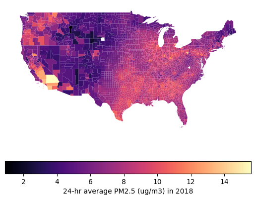

So, air pollution is a silent killer :skull:, and Fine Particulate Matter (PM<sub>2.5</sub>) is one of the nastiest ones out there. These tiny particles (smaller than 2.5 micrometers!) can sneak deep into our lungs and bloodstream, causing all sorts of health trouble.

In this post, I'm going to show you how to visualize PM<sub>2.5</sub> levels across the US using Python. We'll grab some raw data from the NIH, clean it up, and make a cool choropleth map to see where the pollution hot spots are. :earth_americas:

By the end of this, you'll know how to:

1. **Load and Clean Data**: Wrangling CSVs with `pandas`.
2. **Handle Geospatial Data**: Playing with shapefiles using `geopandas`.
3. **Merge Datasets**: Smashing statistical data together with geographic boundaries.
4. **Visualize Results**: Making pretty maps with `matplotlib`.

## Prerequisites

You'll need these Python libraries. If you don't have them, just pip install them:

```python
# %pip install pandas geopandas folium matplotlib mapclassify
```

Let's import the goods:

```python
import pandas as pd
import geopandas as gpd
import matplotlib.pyplot as plt
```

## Step 1: Loading the Data

I got this dataset from the [NIH HDPulse project](https://hdpulse.nimhd.nih.gov/). It has the annual average PM<sub>2.5</sub> concentrations by county.

We'll read the CSV, skipping the first 5 rows because they're just metadata headers.

```python
# Download the data from US NIH
# Source: https://hdpulse.nimhd.nih.gov/data-portal/physical/table...

county_pm25: pd.DataFrame = pd.read_csv(
    "HDPulse_data_export.csv",
    skiprows=5,
)
```

Let's peek at the raw data:

```python
county_pm25.head()
```

## Step 2: Data Cleaning and Processing

Real-world data is messy. Always. :sweat_smile: So we need to clean it up a bit:

1. **Convert PM<sub>2.5</sub> to Numeric**: Sometimes numbers get read as text. We'll force them to be numbers and turn any "No Data" into `NaN`.
2. **Format FIPS Codes**: The FIPS code is like a social security number for counties. We need it to be a 5-digit string (e.g., "06073" for San Diego) to match our map data later.
3. **Remove Missing Data**: If we don't have a FIPS code or a pollution reading, we can't map it. So, bye-bye rows! :wave:

```python
county_pm25_processed: pd.DataFrame = (
    county_pm25.assign(
        # Convert PM2.5 reading to a float, coercing errors to NaN
        pm25_ug_per_m3=lambda x: pd.to_numeric(arg=x[x.keys()[-1]], errors="coerce"),
        # Ensure FIPS is numeric first to handle any weird formatting
        FIPS=lambda x: pd.to_numeric(x["FIPS"], errors="coerce"),
    )
    .dropna(
        # Drop rows with missing FIPS or PM2.5 readings
        subset=["FIPS", "pm25_ug_per_m3"],
    )
    .assign(
        # Convert FIPS to a 5-digit string, padding with leading zeros
        FIPS=lambda x: x["FIPS"].astype(int).astype(str).str.zfill(5),
    )
)
```

## Step 3: Getting Geospatial Data

To draw the map, we need the shapes of US counties. The Census Bureau gives us these "shapefiles". `geopandas` makes loading them a breeze.

```python
# Download US county shapefiles from the Census Bureau
counties: gpd.GeoDataFrame = gpd.read_file(
    "https://www2.census.gov/geo/tiger/GENZ2018/shp/cb_2018_us_county_500k.zip"
)
```

The Census data splits the FIPS code into state (`STATEFP`) and county (`COUNTYFP`) parts. We need to glue them together to match our pollution data.

```python
counties_processed: gpd.GeoDataFrame = counties.assign(
    FIPS=lambda x: x["STATEFP"] + x["COUNTYFP"],
)
```

## Step 4: Merging Data

Now we have two datasets:

1. `county_pm25_processed`: The pollution numbers.
2. `counties_processed`: The map shapes.

Let's merge them on the `FIPS` column! I'm using a "left" merge to keep all the county shapes, even if we're missing data for some (though hopefully we have most of it).

```python
# Merge the geospatial data with the pollution data
counties_w_pm25 = counties_processed.merge(
    right=county_pm25_processed,
    on="FIPS",
    how="left",
)
```

## Step 5: Visualizing the Data

Finally, the fun part! :art: We'll filter out the territories and non-contiguous states (sorry Alaska and Hawaii, just for this map!) to focus on the "Lower 48".

I'm using the `magma` colormap because it looks cool and is easy to read.

```python
# Filter for Contiguous US (State FIPS <= 56, excluding Alaska (02) and Hawaii (15))
contiguous_us = counties_w_pm25.pipe(
    lambda x: x[(x['STATEFP'].astype(int) <= 56) & (~x['STATEFP'].astype(int).isin([2, 15]))]
)

# Plot the map
fig, ax = plt.subplots(1, 1, figsize=(15, 10))
contiguous_us.plot(
    column='pm25_ug_per_m3',
    legend=False,
    cmap='magma',
    ax=ax
)

# Remove axis for a cleaner look
ax.set_axis_off()

# Add a colorbar
sm = plt.cm.ScalarMappable(cmap='magma', norm=plt.Normalize(vmin=contiguous_us['pm25_ug_per_m3'].min(), vmax=contiguous_us['pm25_ug_per_m3'].max()))
sm._A = [] # Dummy array for the ScalarMappable
cbar = fig.colorbar(sm, ax=ax, orientation='horizontal', fraction=0.046, pad=0.04)
cbar.set_label('24-hr Average PM2.5 (µg/m³) in 2018')

plt.title("PM2.5 Concentration by County in the Contiguous US", fontsize=16)
plt.show()
```



## Interactive Map

Static maps are nice, but interactive maps are better. `geopandas` has this awesome `.explore()` method that lets you zoom and hover.

```python
# Create an interactive map
m = counties_w_pm25.explore(
    column="pm25_ug_per_m3",
    tooltip=["County", "pm25_ug_per_m3"], # Show county name and value on hover
    cmap="magma",
)
m
```

[View Interactive Map](../../../uploads/2024-12-06-plotting-pm25-us-by-county.html)

## Conclusion

And there you have it! We successfully visualized PM<sub>2.5</sub> data across the US. We learned how to clean messy real-world data, handle FIPS codes, and create some sweet maps.

You can use this same workflow for pretty much any county-level data—census stuff, election results, you name it. Happy mapping! :world_map:
