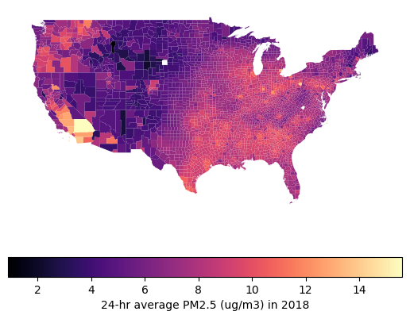

```python
# %pip install pandas geopandas folium matplotlib mapclassify
```

```python
import pandas as pd
import geopandas as gpd
import matplotlib.pyplot as plt
```

```python
# download the data from US NIH (https://hdpulse.nimhd.nih.gov/data-portal/physical/table?age=001&age_options=ageall_1&demo=234&demo_options=air_pollution_1&physicaltopic=002&physicaltopic_options=physical_2&race=00&race_options=raceall_1&sex=0&sex_options=sexboth_1&statefips=99&statefips_options=area_states)

county_pm25: pd.DataFrame = pd.read_csv(
    "HDPulse_data_export.csv",
    skiprows=5,
)
```

```python
county_pm25
```

<div>
<style scoped>
    .dataframe tbody tr th:only-of-type {
        vertical-align: middle;
    }

    .dataframe tbody tr th {
        vertical-align: top;
    }

    .dataframe thead th {
        text-align: right;
    }
</style>
<table border="1" class="dataframe">
  <thead>
    <tr style="text-align: right;">
      <th></th>
      <th>County</th>
      <th>FIPS</th>
      <th>Micrograms per cubic meter (PM2.5)(2)</th>
    </tr>
  </thead>
  <tbody>
    <tr>
      <th>0</th>
      <td>United States</td>
      <td>0.0</td>
      <td>7.4</td>
    </tr>
    <tr>
      <th>1</th>
      <td>San Bernardino County, California</td>
      <td>6071.0</td>
      <td>15.6</td>
    </tr>
    <tr>
      <th>2</th>
      <td>Fairbanks North Star, Alaska</td>
      <td>2090.0</td>
      <td>15.5</td>
    </tr>
    <tr>
      <th>3</th>
      <td>Allegheny County, Pennsylvania</td>
      <td>42003.0</td>
      <td>14.1</td>
    </tr>
    <tr>
      <th>4</th>
      <td>San Diego County, California</td>
      <td>6073.0</td>
      <td>13.8</td>
    </tr>
    <tr>
      <th>...</th>
      <td>...</td>
      <td>...</td>
      <td>...</td>
    </tr>
    <tr>
      <th>3146</th>
      <td>Notes:</td>
      <td>NaN</td>
      <td>NaN</td>
    </tr>
    <tr>
      <th>3147</th>
      <td>Source: National Environmental Public Health T...</td>
      <td>NaN</td>
      <td>NaN</td>
    </tr>
    <tr>
      <th>3148</th>
      <td>Average daily density of fine particulate matt...</td>
      <td>NaN</td>
      <td>NaN</td>
    </tr>
    <tr>
      <th>3149</th>
      <td>Some data are not available or suppressed due ...</td>
      <td>NaN</td>
      <td>NaN</td>
    </tr>
    <tr>
      <th>3150</th>
      <td>Note: This website still uses Connecticut coun...</td>
      <td>NaN</td>
      <td>NaN</td>
    </tr>
  </tbody>
</table>
<p>3151 rows × 3 columns</p>
</div>

```python
county_pm25_processed: pd.DataFrame = (
    county_pm25.assign(
        # make PM2.5 reading a float
        pm25_ug_per_m3=lambda x: pd.to_numeric(arg=x[x.keys()[-1]], errors="coerce"),
        # convert FIPS to a 5-digit string
        FIPS=lambda x: pd.to_numeric(x["FIPS"]),
    )
    .dropna(
        # drop rows with missing PM2.5 readings
        subset=[
            "FIPS",
            "pm25_ug_per_m3",
        ],
    )
    .assign(
        FIPS=lambda x: x["FIPS"].astype(int).astype(str).str.zfill(5),
    )
)
```

```python
# optional sense check
county_pm25_processed
```

<div>
<style scoped>
    .dataframe tbody tr th:only-of-type {
        vertical-align: middle;
    }

    .dataframe tbody tr th {
        vertical-align: top;
    }

    .dataframe thead th {
        text-align: right;
    }
</style>
<table border="1" class="dataframe">
  <thead>
    <tr style="text-align: right;">
      <th></th>
      <th>County</th>
      <th>FIPS</th>
      <th>Micrograms per cubic meter (PM2.5)(2)</th>
      <th>pm25_ug_per_m3</th>
    </tr>
  </thead>
  <tbody>
    <tr>
      <th>0</th>
      <td>United States</td>
      <td>00000</td>
      <td>7.4</td>
      <td>7.4</td>
    </tr>
    <tr>
      <th>1</th>
      <td>San Bernardino County, California</td>
      <td>06071</td>
      <td>15.6</td>
      <td>15.6</td>
    </tr>
    <tr>
      <th>2</th>
      <td>Fairbanks North Star, Alaska</td>
      <td>02090</td>
      <td>15.5</td>
      <td>15.5</td>
    </tr>
    <tr>
      <th>3</th>
      <td>Allegheny County, Pennsylvania</td>
      <td>42003</td>
      <td>14.1</td>
      <td>14.1</td>
    </tr>
    <tr>
      <th>4</th>
      <td>San Diego County, California</td>
      <td>06073</td>
      <td>13.8</td>
      <td>13.8</td>
    </tr>
    <tr>
      <th>...</th>
      <td>...</td>
      <td>...</td>
      <td>...</td>
      <td>...</td>
    </tr>
    <tr>
      <th>3111</th>
      <td>Custer County, South Dakota</td>
      <td>46033</td>
      <td>2.6</td>
      <td>2.6</td>
    </tr>
    <tr>
      <th>3112</th>
      <td>Apache County, Arizona</td>
      <td>04001</td>
      <td>2.5</td>
      <td>2.5</td>
    </tr>
    <tr>
      <th>3113</th>
      <td>Campbell County, Wyoming</td>
      <td>56005</td>
      <td>2.4</td>
      <td>2.4</td>
    </tr>
    <tr>
      <th>3114</th>
      <td>Converse County, Wyoming</td>
      <td>56009</td>
      <td>2.2</td>
      <td>2.2</td>
    </tr>
    <tr>
      <th>3115</th>
      <td>Gallatin County, Montana</td>
      <td>30031</td>
      <td>0.9</td>
      <td>0.9</td>
    </tr>
  </tbody>
</table>
<p>3116 rows × 4 columns</p>
</div>

```python
# download us county shape files from https://www.census.gov/geographies/mapping-files/time-series/geo/carto-boundary-file.html
counties: gpd.GeoDataFrame = gpd.read_file(
    "https://www2.census.gov/geo/tiger/GENZ2018/shp/cb_2018_us_county_500k.zip"
)
```

```python
counties_processed: gpd.GeoDataFrame = counties.assign(
    FIPS=lambda x: x["STATEFP"] + x["COUNTYFP"],
)
```

```python
# optional sense check
counties_processed
```

<div>
<style scoped>
    .dataframe tbody tr th:only-of-type {
        vertical-align: middle;
    }

    .dataframe tbody tr th {
        vertical-align: top;
    }

    .dataframe thead th {
        text-align: right;
    }
</style>
<table border="1" class="dataframe">
  <thead>
    <tr style="text-align: right;">
      <th></th>
      <th>STATEFP</th>
      <th>COUNTYFP</th>
      <th>COUNTYNS</th>
      <th>AFFGEOID</th>
      <th>GEOID</th>
      <th>NAME</th>
      <th>LSAD</th>
      <th>ALAND</th>
      <th>AWATER</th>
      <th>geometry</th>
      <th>FIPS</th>
    </tr>
  </thead>
  <tbody>
    <tr>
      <th>0</th>
      <td>21</td>
      <td>007</td>
      <td>00516850</td>
      <td>0500000US21007</td>
      <td>21007</td>
      <td>Ballard</td>
      <td>06</td>
      <td>639387454</td>
      <td>69473325</td>
      <td>POLYGON ((-89.18137 37.0463, -89.17938 37.0530...</td>
      <td>21007</td>
    </tr>
    <tr>
      <th>1</th>
      <td>21</td>
      <td>017</td>
      <td>00516855</td>
      <td>0500000US21017</td>
      <td>21017</td>
      <td>Bourbon</td>
      <td>06</td>
      <td>750439351</td>
      <td>4829777</td>
      <td>POLYGON ((-84.44266 38.28324, -84.44114 38.283...</td>
      <td>21017</td>
    </tr>
    <tr>
      <th>2</th>
      <td>21</td>
      <td>031</td>
      <td>00516862</td>
      <td>0500000US21031</td>
      <td>21031</td>
      <td>Butler</td>
      <td>06</td>
      <td>1103571974</td>
      <td>13943044</td>
      <td>POLYGON ((-86.94486 37.07341, -86.94346 37.074...</td>
      <td>21031</td>
    </tr>
    <tr>
      <th>3</th>
      <td>21</td>
      <td>065</td>
      <td>00516879</td>
      <td>0500000US21065</td>
      <td>21065</td>
      <td>Estill</td>
      <td>06</td>
      <td>655509930</td>
      <td>6516335</td>
      <td>POLYGON ((-84.12662 37.6454, -84.12483 37.6461...</td>
      <td>21065</td>
    </tr>
    <tr>
      <th>4</th>
      <td>21</td>
      <td>069</td>
      <td>00516881</td>
      <td>0500000US21069</td>
      <td>21069</td>
      <td>Fleming</td>
      <td>06</td>
      <td>902727151</td>
      <td>7182793</td>
      <td>POLYGON ((-83.98428 38.44549, -83.98246 38.450...</td>
      <td>21069</td>
    </tr>
    <tr>
      <th>...</th>
      <td>...</td>
      <td>...</td>
      <td>...</td>
      <td>...</td>
      <td>...</td>
      <td>...</td>
      <td>...</td>
      <td>...</td>
      <td>...</td>
      <td>...</td>
      <td>...</td>
    </tr>
    <tr>
      <th>3228</th>
      <td>31</td>
      <td>073</td>
      <td>00835858</td>
      <td>0500000US31073</td>
      <td>31073</td>
      <td>Gosper</td>
      <td>06</td>
      <td>1186616237</td>
      <td>11831826</td>
      <td>POLYGON ((-100.0951 40.43866, -100.08937 40.43...</td>
      <td>31073</td>
    </tr>
    <tr>
      <th>3229</th>
      <td>39</td>
      <td>075</td>
      <td>01074050</td>
      <td>0500000US39075</td>
      <td>39075</td>
      <td>Holmes</td>
      <td>06</td>
      <td>1094405866</td>
      <td>3695230</td>
      <td>POLYGON ((-82.22066 40.66758, -82.19327 40.667...</td>
      <td>39075</td>
    </tr>
    <tr>
      <th>3230</th>
      <td>48</td>
      <td>171</td>
      <td>01383871</td>
      <td>0500000US48171</td>
      <td>48171</td>
      <td>Gillespie</td>
      <td>06</td>
      <td>2740719114</td>
      <td>9012764</td>
      <td>POLYGON ((-99.304 30.49983, -99.28234 30.49967...</td>
      <td>48171</td>
    </tr>
    <tr>
      <th>3231</th>
      <td>55</td>
      <td>079</td>
      <td>01581100</td>
      <td>0500000US55079</td>
      <td>55079</td>
      <td>Milwaukee</td>
      <td>06</td>
      <td>625440563</td>
      <td>2455383635</td>
      <td>POLYGON ((-88.06959 42.86726, -88.06959 42.872...</td>
      <td>55079</td>
    </tr>
    <tr>
      <th>3232</th>
      <td>26</td>
      <td>139</td>
      <td>01623012</td>
      <td>0500000US26139</td>
      <td>26139</td>
      <td>Ottawa</td>
      <td>06</td>
      <td>1459502408</td>
      <td>2765830983</td>
      <td>POLYGON ((-86.26432 43.1183, -86.25103 43.1182...</td>
      <td>26139</td>
    </tr>
  </tbody>
</table>
<p>3233 rows × 11 columns</p>
</div>

```python
# merge the two dataframes
counties_w_pm25 = counties_processed.merge(
    right=county_pm25_processed,
    on="FIPS",
    how="left",
)
```

```python
# optional sense check
counties_w_pm25.STATEFP.unique()
```

    array(['21', '17', '18', '01', '02', '05', '06', '08', '09', '11', '12',
           '13', '15', '16', '19', '20', '48', '29', '30', '31', '53', '22',
           '23', '24', '34', '35', '36', '37', '38', '39', '40', '49', '41',
           '42', '45', '46', '47', '25', '26', '51', '72', '78', '27', '28',
           '32', '33', '04', '54', '55', '56', '60', '69', '50', '10', '44',
           '66'], dtype=object)

```python
# display PM2.5 in Contiguous US
ax = counties_w_pm25.pipe(
    lambda x: x[
        (x["STATEFP"].astype(int) <= 56) & ~(x["STATEFP"].astype(int).isin([2, 15]))
    ]
).plot(
    column="pm25_ug_per_m3",
    legend=False,
    cmap="magma",
)
ax.set_axis_off()

# Customize the colorbar
plt.colorbar(
    ax.collections[0],
    orientation="horizontal",
    label="24-hr average PM2.5 (ug/m3) in 2018",
)

plt.show()
```

    

    

```python
# display the data on map by level of PM2.5
m = counties_w_pm25.explore(
    column="pm25_ug_per_m3",
)
```
