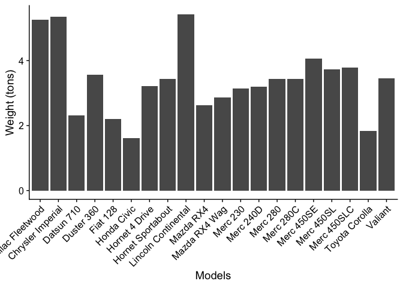
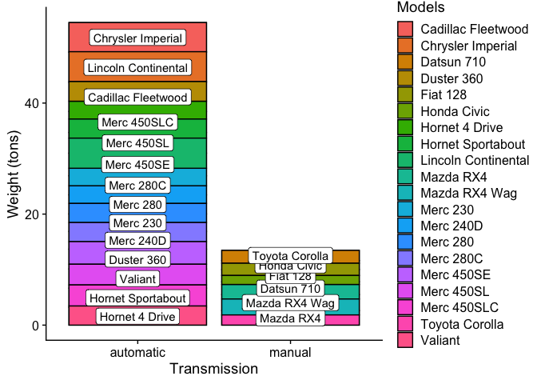
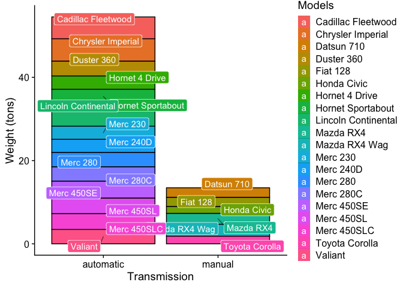
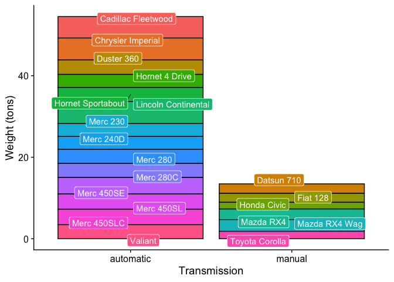

This is an example to draw a informative bar chart using "geom_label" from "ggplot2".

Let’s start with generating some sample data.

``` r
# we will use the Motor Trend Car Road Tests datasets from R base (only the first 15 models for better illustration)
# run ?mtcars for details of the datasets
df = mtcars[1:20,]

# showing the first 7 rows of the data frame for illustration
head(x = df, n = 7)
```

    ##                    mpg cyl disp  hp drat    wt  qsec vs am gear carb
    ## Mazda RX4         21.0   6  160 110 3.90 2.620 16.46  0  1    4    4
    ## Mazda RX4 Wag     21.0   6  160 110 3.90 2.875 17.02  0  1    4    4
    ## Datsun 710        22.8   4  108  93 3.85 2.320 18.61  1  1    4    1
    ## Hornet 4 Drive    21.4   6  258 110 3.08 3.215 19.44  1  0    3    1
    ## Hornet Sportabout 18.7   8  360 175 3.15 3.440 17.02  0  0    3    2
    ## Valiant           18.1   6  225 105 2.76 3.460 20.22  1  0    3    1
    ## Duster 360        14.3   8  360 245 3.21 3.570 15.84  0  0    3    4

Suppose we wants to show the weight in tons (wt) of the cars, we start
with a basic bar chart.

``` r
library(ggplot2)  # for plotting
library(cowplot)  # for publication friendly ggplot themes

# setting up the base plot
g = ggplot(data = df, mapping = aes(x = rownames(df), y = wt)) + geom_bar(stat = "identity") + theme_cowplot() + labs(x = "Models", y = "Weight (tons)")

g
```

<!-- -->

Oh, the names of the models are all overlapped…Let’s fix it by rotating
them by 45º.

``` r
# fixing the overlapped the labels of the x-axis
g1 = g + theme(axis.text.x = element_text(angle = 45, hjust = 1))
g1
```

<!-- -->

Looks not bad.

Now, let’s suppose that we somehow want to know the total weight of
automatic transmission cars vs manual transmission cars (i.e., based on
the `am` column), we can visualize it by stacking up the bars.

``` r
# converting the entries in the "am" column into factor-valued (Note: 0 = autmatic, 1 = manual, in the original data)
df$am = factor(df$am, labels = c("automatic", "manual"))

# fixing the overlapped the labels of the x-axis
g2 = ggplot(data = df, mapping = aes(x = am, y = wt)) + geom_bar(stat = "identity", position = "stack", color = "black") + theme_cowplot() + labs(x = "Transmission", y = "Weight (tons)")
g2
```

<!-- -->

Wow, we now know that the cars with automatic transmission are heavier
than the manual ones. We can also show how much weight each car has
contributed.

``` r
# adding colors to the bar
g3 = g2 + geom_bar(mapping = aes(fill = row.names(df)), stat = "identity", position = "stack", color = "black") + labs(fill = "Models")
g3
```

<!-- -->

Not bad. But, what cross referencing between the bar segments and the
legend makes people’s eyes sore. Can it be easier? Yes, and the answer
is `geom_label`.

``` r
# adding labels on the bar chart
g4 = g3 + geom_label(mapping = aes(label = row.names(df)), position = position_stack(vjust = 0.5))
g4
```

<!-- -->

Wait, there are two problems. First, the labels are mismatch\!\!\!
Second, labels are overlapped\!\!\! For the first problem, it is because
`geom_label` and `geom_bar` are not sharing the same mapping aesthetics,
i.e., `fill` is only defined in `geom_bar` only. Therefore, the data are
not “grouped” properly for both objects. The fix is to set `fill` as a
global variable. For the second problem, we seek help from the package
`ggrepel`. Let’s check out the codes:

``` r
# adding a new grouping variable to the plot
g5 = ggplot(data = df, mapping = aes(x = am, y = wt, fill = row.names(df))) + theme_cowplot() + labs(x = "Transmission", y = "Weight (tons)", fill = "Models")

# adding the bar chart
g5 = g5 + geom_bar(stat = "identity", position = "stack", color = "black")

# adding new labels
library(ggrepel) # for the function (geom_label_repel)
g5 = g5 + geom_label_repel(mapping = aes(label = row.names(df)), position = position_stack(vjust = 0.5), color = "white", segment.alpha = 0.5, segment.color = "black")

g5
```

<!-- -->

After ensuring the labels are correctly matched, we can even omit the
legend which is kinda redundant.

``` r
# turning off the guides
g6 = g5 + scale_fill_discrete(guide = guide_none())

g6
```

<!-- -->
