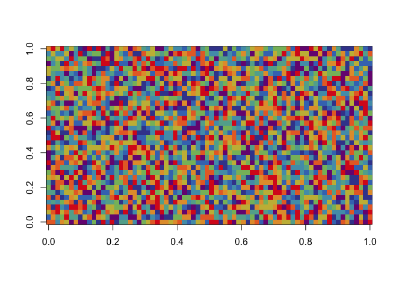
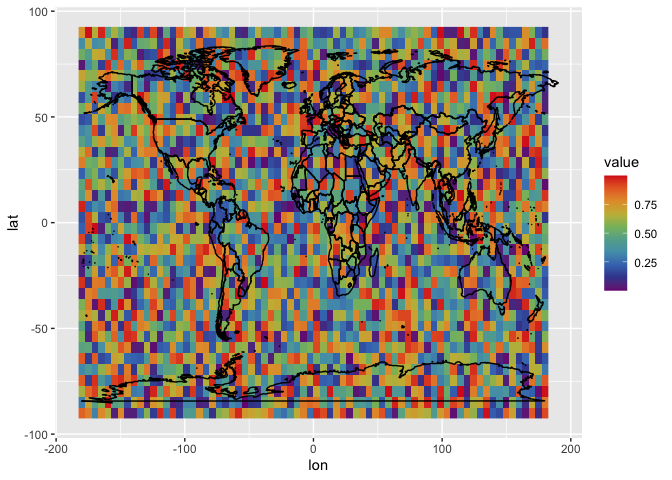
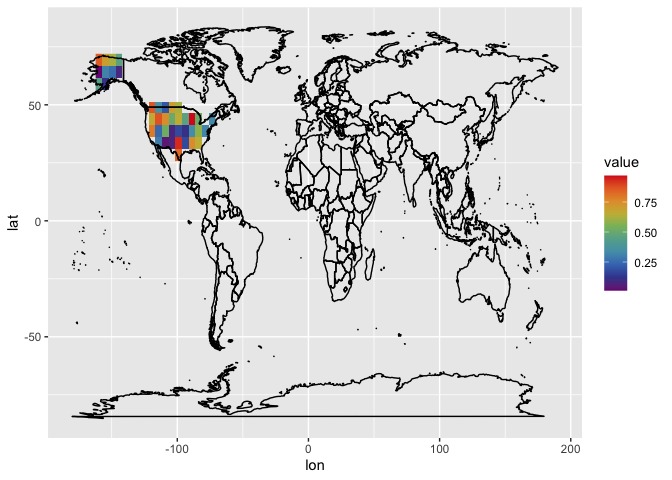

This is an example to append geographic information to gridded data for
regional analysis.

``` r
# *** use install.packages to get the packages for the first time ***
library(raster)       # for handling raster object in R
library(tidyverse)    # for ggplot2 and other data processing packages
library(reshape2)     # for preparing data.frame object for ggplot2
library(pals)          # for prettier color choices
```

## Step 0: Making up some sample data matrix

``` r
lon = seq(-180, 180, length.out = 72)
lat = seq(-90, 90, length.out = 36)

X.matrix = matrix(data = runif(n = 72 * 36), 
                  nrow = 72,  # number of lon-element
                  ncol = 36)  # number of lat-element

image(X.matrix, col = tol.rainbow(10))
```



``` r
# Convert that matrix into data frame
dimnames(X.matrix) = list(lon = lon, lat = lat)  # we rename the 1st dimension of X as lon, 2nd as lat and assign the names row and col as values of lon.vector and lat.vector

# so that we can use one line to make it a data frame
X.df = melt(X.matrix)

# check the first 5 rows of the data
head(X.df, 5)
```

    ##         lon lat     value
    ## 1 -180.0000 -90 0.8672613
    ## 2 -174.9296 -90 0.8062684
    ## 3 -169.8592 -90 0.3092147
    ## 4 -164.7887 -90 0.7819696
    ## 5 -159.7183 -90 0.6498956

and optionally visualize the data frame

``` r
X.df %>% ggplot(aes(x = lon, y = lat)) +
  geom_raster(aes(fill = value)) +
  scale_fill_gradientn(colors = tol.rainbow(10)) +
  borders(colour = "black")
```




## Step 1: Downloading the “shape” of the US

``` r
USA.sp = raster::getData(name = 'GADM', # name of database
                   country ='USA', # country code of the US
                   level = 1, # border detail level 1 is state level, 2 is county, 3 is city
                   download = TRUE)

head(USA.sp)
```

    ##    GID_0        NAME_0   GID_1     NAME_1 VARNAME_1 NL_NAME_1 TYPE_1 ENGTYPE_1 CC_1 HASC_1
    ## 1    USA United States USA.1_1    Alabama   AL|Ala.      <NA>  State     State <NA>  US.AL
    ## 12   USA United States USA.2_1     Alaska AK|Alaska      <NA>  State     State <NA>  US.AK
    ## 23   USA United States USA.3_1    Arizona  AZ|Ariz.      <NA>  State     State <NA>  US.AZ
    ## 34   USA United States USA.4_1   Arkansas   AR|Ark.      <NA>  State     State <NA>  US.AR
    ## 45   USA United States USA.5_1 California CA|Calif.      <NA>  State     State <NA>  US.CA
    ## 48   USA United States USA.6_1   Colorado  CO|Colo.      <NA>  State     State <NA>  US.CO


## Step 2: Matching (lon, lat)-pairs with regional information

``` r
# this line isolate the distinct (lon, lat)-pairs for faster computation incase X is large
X.lonlat = X.df %>% 
  select(lon, lat) %>% 
  distinct() 

X.lonlat$region = over(x = SpatialPoints(coords = X.lonlat, proj4string = CRS(proj4string(USA.sp))), 
                       y = USA.sp)

# concat the regional information back to the data frame
X.df = X.df %>% left_join(X.lonlat)
```

    ## Joining, by = c("lon", "lat")


## Step 3: Calculating e.g., regional average

``` r
X.df %>% 
  group_by(region$NAME_1) %>% 
  summarize(value = mean(value, na.rm = T))
```

    ## `summarise()` ungrouping output (override with `.groups` argument)

    ## # A tibble: 26 x 2
    ##    `region$NAME_1` value
    ##    <chr>           <dbl>
    ##  1 Alaska          0.385
    ##  2 Arizona         0.291
    ##  3 Arkansas        0.173
    ##  4 Colorado        0.298
    ##  5 Georgia         0.656
    ##  6 Idaho           0.874
    ##  7 Illinois        0.337
    ##  8 Kansas          0.172
    ##  9 Kentucky        0.579
    ## 10 Michigan        0.506
    ## # … with 16 more rows

Or isolating only US data on your map.

``` r
X.df %>% 
  filter(region$GID_0 == "USA") %>%
  ggplot(aes(x = lon, y = lat)) +
  geom_raster(aes(fill = value)) +
  scale_fill_gradientn(colors = tol.rainbow(10)) +
  borders(colour = "black")
```


