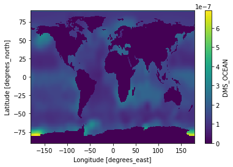
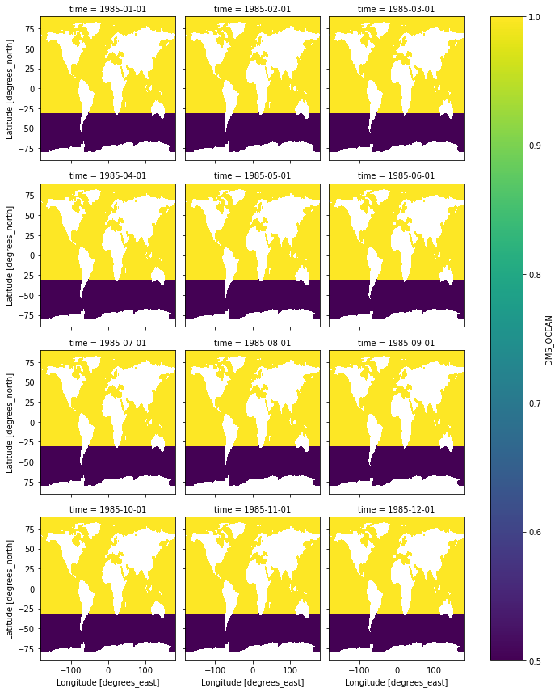

<!-- *Created by [Ka Ming Fung](kamingfung@link.cuhk.edu.hk)* -->

## *Reference:*
For general python handling of nc files using Xarray: http://xarray.pydata.org/en/stable/index.html


I am working on a set of input data of Ocean DMS concentration. I suspect the reported values over the Southern Ocean (vaguely defined as ocean south to 30ºS) is a bit high. I want to reduce those values by 50% to see if my model will match observations better.

Surprisingly, I didn't find a quick way to do it. Here I present a work-a-round. (Please let me know if you have a smarter way.)


```python
import wget                        # for downloading data via URL links
import xarray as xr                   # the major tool to work with NetCDF data!
from matplotlib import pyplot as plt  # for plotting

```

## Open the monthly Ocean DMS nc file

The marine DMS data used in this example can be downloaded [here](http://rain.ucis.dal.ca/ctm/HEMCO/DMS/v2015-07/DMS_lana.geos.1x1.nc). Or, we can download it from `Python`.


```python
wget.download('http://rain.ucis.dal.ca/ctm/HEMCO/DMS/v2015-07/DMS_lana.geos.1x1.nc')
```


    'DMS_lana.geos.1x1.nc'


We will use the function `xr.open_dataset` from the xarray package.


```python
ds = xr.open_dataset('DMS_lana.geos.1x1.nc')

ds # display the dataset
```


<div><svg style="position: absolute; width: 0; height: 0; overflow: hidden">
<defs>
<symbol id="icon-database" viewBox="0 0 32 32">
<path d="M16 0c-8.837 0-16 2.239-16 5v4c0 2.761 7.163 5 16 5s16-2.239 16-5v-4c0-2.761-7.163-5-16-5z"></path>
<path d="M16 17c-8.837 0-16-2.239-16-5v6c0 2.761 7.163 5 16 5s16-2.239 16-5v-6c0 2.761-7.163 5-16 5z"></path>
<path d="M16 26c-8.837 0-16-2.239-16-5v6c0 2.761 7.163 5 16 5s16-2.239 16-5v-6c0 2.761-7.163 5-16 5z"></path>
</symbol>
<symbol id="icon-file-text2" viewBox="0 0 32 32">
<path d="M28.681 7.159c-0.694-0.947-1.662-2.053-2.724-3.116s-2.169-2.030-3.116-2.724c-1.612-1.182-2.393-1.319-2.841-1.319h-15.5c-1.378 0-2.5 1.121-2.5 2.5v27c0 1.378 1.122 2.5 2.5 2.5h23c1.378 0 2.5-1.122 2.5-2.5v-19.5c0-0.448-0.137-1.23-1.319-2.841zM24.543 5.457c0.959 0.959 1.712 1.825 2.268 2.543h-4.811v-4.811c0.718 0.556 1.584 1.309 2.543 2.268zM28 29.5c0 0.271-0.229 0.5-0.5 0.5h-23c-0.271 0-0.5-0.229-0.5-0.5v-27c0-0.271 0.229-0.5 0.5-0.5 0 0 15.499-0 15.5 0v7c0 0.552 0.448 1 1 1h7v19.5z"></path>
<path d="M23 26h-14c-0.552 0-1-0.448-1-1s0.448-1 1-1h14c0.552 0 1 0.448 1 1s-0.448 1-1 1z"></path>
<path d="M23 22h-14c-0.552 0-1-0.448-1-1s0.448-1 1-1h14c0.552 0 1 0.448 1 1s-0.448 1-1 1z"></path>
<path d="M23 18h-14c-0.552 0-1-0.448-1-1s0.448-1 1-1h14c0.552 0 1 0.448 1 1s-0.448 1-1 1z"></path>
</symbol>
</defs>
</svg>
<style>/* CSS stylesheet for displaying xarray objects in jupyterlab.
 *
 */

:root {
  --xr-font-color0: var(--jp-content-font-color0, rgba(0, 0, 0, 1));
  --xr-font-color2: var(--jp-content-font-color2, rgba(0, 0, 0, 0.54));
  --xr-font-color3: var(--jp-content-font-color3, rgba(0, 0, 0, 0.38));
  --xr-border-color: var(--jp-border-color2, #e0e0e0);
  --xr-disabled-color: var(--jp-layout-color3, #bdbdbd);
  --xr-background-color: var(--jp-layout-color0, white);
  --xr-background-color-row-even: var(--jp-layout-color1, white);
  --xr-background-color-row-odd: var(--jp-layout-color2, #eeeeee);
}

html[theme=dark],
body.vscode-dark {
  --xr-font-color0: rgba(255, 255, 255, 1);
  --xr-font-color2: rgba(255, 255, 255, 0.54);
  --xr-font-color3: rgba(255, 255, 255, 0.38);
  --xr-border-color: #1F1F1F;
  --xr-disabled-color: #515151;
  --xr-background-color: #111111;
  --xr-background-color-row-even: #111111;
  --xr-background-color-row-odd: #313131;
}

.xr-wrap {
  display: block;
  min-width: 300px;
  max-width: 700px;
}

.xr-text-repr-fallback {
  /* fallback to plain text repr when CSS is not injected (untrusted notebook) */
  display: none;
}

.xr-header {
  padding-top: 6px;
  padding-bottom: 6px;
  margin-bottom: 4px;
  border-bottom: solid 1px var(--xr-border-color);
}

.xr-header > div,
.xr-header > ul {
  display: inline;
  margin-top: 0;
  margin-bottom: 0;
}

.xr-obj-type,
.xr-array-name {
  margin-left: 2px;
  margin-right: 10px;
}

.xr-obj-type {
  color: var(--xr-font-color2);
}

.xr-sections {
  padding-left: 0 !important;
  display: grid;
  grid-template-columns: 150px auto auto 1fr 20px 20px;
}

.xr-section-item {
  display: contents;
}

.xr-section-item input {
  display: none;
}

.xr-section-item input + label {
  color: var(--xr-disabled-color);
}

.xr-section-item input:enabled + label {
  cursor: pointer;
  color: var(--xr-font-color2);
}

.xr-section-item input:enabled + label:hover {
  color: var(--xr-font-color0);
}

.xr-section-summary {
  grid-column: 1;
  color: var(--xr-font-color2);
  font-weight: 500;
}

.xr-section-summary > span {
  display: inline-block;
  padding-left: 0.5em;
}

.xr-section-summary-in:disabled + label {
  color: var(--xr-font-color2);
}

.xr-section-summary-in + label:before {
  display: inline-block;
  content: '►';
  font-size: 11px;
  width: 15px;
  text-align: center;
}

.xr-section-summary-in:disabled + label:before {
  color: var(--xr-disabled-color);
}

.xr-section-summary-in:checked + label:before {
  content: '▼';
}

.xr-section-summary-in:checked + label > span {
  display: none;
}

.xr-section-summary,
.xr-section-inline-details {
  padding-top: 4px;
  padding-bottom: 4px;
}

.xr-section-inline-details {
  grid-column: 2 / -1;
}

.xr-section-details {
  display: none;
  grid-column: 1 / -1;
  margin-bottom: 5px;
}

.xr-section-summary-in:checked ~ .xr-section-details {
  display: contents;
}

.xr-array-wrap {
  grid-column: 1 / -1;
  display: grid;
  grid-template-columns: 20px auto;
}

.xr-array-wrap > label {
  grid-column: 1;
  vertical-align: top;
}

.xr-preview {
  color: var(--xr-font-color3);
}

.xr-array-preview,
.xr-array-data {
  padding: 0 5px !important;
  grid-column: 2;
}

.xr-array-data,
.xr-array-in:checked ~ .xr-array-preview {
  display: none;
}

.xr-array-in:checked ~ .xr-array-data,
.xr-array-preview {
  display: inline-block;
}

.xr-dim-list {
  display: inline-block !important;
  list-style: none;
  padding: 0 !important;
  margin: 0;
}

.xr-dim-list li {
  display: inline-block;
  padding: 0;
  margin: 0;
}

.xr-dim-list:before {
  content: '(';
}

.xr-dim-list:after {
  content: ')';
}

.xr-dim-list li:not(:last-child):after {
  content: ',';
  padding-right: 5px;
}

.xr-has-index {
  font-weight: bold;
}

.xr-var-list,
.xr-var-item {
  display: contents;
}

.xr-var-item > div,
.xr-var-item label,
.xr-var-item > .xr-var-name span {
  background-color: var(--xr-background-color-row-even);
  margin-bottom: 0;
}

.xr-var-item > .xr-var-name:hover span {
  padding-right: 5px;
}

.xr-var-list > li:nth-child(odd) > div,
.xr-var-list > li:nth-child(odd) > label,
.xr-var-list > li:nth-child(odd) > .xr-var-name span {
  background-color: var(--xr-background-color-row-odd);
}

.xr-var-name {
  grid-column: 1;
}

.xr-var-dims {
  grid-column: 2;
}

.xr-var-dtype {
  grid-column: 3;
  text-align: right;
  color: var(--xr-font-color2);
}

.xr-var-preview {
  grid-column: 4;
}

.xr-var-name,
.xr-var-dims,
.xr-var-dtype,
.xr-preview,
.xr-attrs dt {
  white-space: nowrap;
  overflow: hidden;
  text-overflow: ellipsis;
  padding-right: 10px;
}

.xr-var-name:hover,
.xr-var-dims:hover,
.xr-var-dtype:hover,
.xr-attrs dt:hover {
  overflow: visible;
  width: auto;
  z-index: 1;
}

.xr-var-attrs,
.xr-var-data {
  display: none;
  background-color: var(--xr-background-color) !important;
  padding-bottom: 5px !important;
}

.xr-var-attrs-in:checked ~ .xr-var-attrs,
.xr-var-data-in:checked ~ .xr-var-data {
  display: block;
}

.xr-var-data > table {
  float: right;
}

.xr-var-name span,
.xr-var-data,
.xr-attrs {
  padding-left: 25px !important;
}

.xr-attrs,
.xr-var-attrs,
.xr-var-data {
  grid-column: 1 / -1;
}

dl.xr-attrs {
  padding: 0;
  margin: 0;
  display: grid;
  grid-template-columns: 125px auto;
}

.xr-attrs dt, dd {
  padding: 0;
  margin: 0;
  float: left;
  padding-right: 10px;
  width: auto;
}

.xr-attrs dt {
  font-weight: normal;
  grid-column: 1;
}

.xr-attrs dt:hover span {
  display: inline-block;
  background: var(--xr-background-color);
  padding-right: 10px;
}

.xr-attrs dd {
  grid-column: 2;
  white-space: pre-wrap;
  word-break: break-all;
}

.xr-icon-database,
.xr-icon-file-text2 {
  display: inline-block;
  vertical-align: middle;
  width: 1em;
  height: 1.5em !important;
  stroke-width: 0;
  stroke: currentColor;
  fill: currentColor;
}
</style><pre class='xr-text-repr-fallback'>&lt;xarray.Dataset&gt;
Dimensions:    (lat: 181, lon: 360, time: 12)
Coordinates:
  * lon        (lon) float32 -180.0 -179.0 -178.0 -177.0 ... 177.0 178.0 179.0
  * lat        (lat) float32 -89.75 -89.0 -88.0 -87.0 ... 87.0 88.0 89.0 89.75
  * time       (time) datetime64[ns] 1985-01-01 1985-02-01 ... 1985-12-01
Data variables:
    DMS_OCEAN  (time, lat, lon) float32 ...
Attributes:
    CDI:          Climate Data Interface version 1.6.4 (http://code.zmaw.de/p...
    Conventions:  COARDS
    history:      Mon Jul 20 16:29:35 2015: ncatted -O -a units,DMS_OCEAN,o,c...
    Title:        COARDS/netCDF file created by BPCH2COARDS (GAMAP v2-17+)
    Format:       NetCDF-3
    Model:        GEOS5_47L
    Delta_Lon:    1.0
    Delta_Lat:    1.0
    NLayers:      47
    Start_Date:   19850101
    Start_Time:   0
    End_Date:     19850201
    End_Time:     0
    Delta_Time:   744
    CDO:          Climate Data Operators version 1.6.4 (http://code.zmaw.de/p...</pre><div class='xr-wrap' hidden><div class='xr-header'><div class='xr-obj-type'>xarray.Dataset</div></div><ul class='xr-sections'><li class='xr-section-item'><input id='section-01da08bc-79c3-4ecf-b2e4-5d7370947d5f' class='xr-section-summary-in' type='checkbox' disabled ><label for='section-01da08bc-79c3-4ecf-b2e4-5d7370947d5f' class='xr-section-summary'  title='Expand/collapse section'>Dimensions:</label><div class='xr-section-inline-details'><ul class='xr-dim-list'><li><span class='xr-has-index'>lat</span>: 181</li><li><span class='xr-has-index'>lon</span>: 360</li><li><span class='xr-has-index'>time</span>: 12</li></ul></div><div class='xr-section-details'></div></li><li class='xr-section-item'><input id='section-3c6a396a-a521-4c16-b5ab-c6938d6d7a5c' class='xr-section-summary-in' type='checkbox'  checked><label for='section-3c6a396a-a521-4c16-b5ab-c6938d6d7a5c' class='xr-section-summary' >Coordinates: <span>(3)</span></label><div class='xr-section-inline-details'></div><div class='xr-section-details'><ul class='xr-var-list'><li class='xr-var-item'><div class='xr-var-name'><span class='xr-has-index'>lon</span></div><div class='xr-var-dims'>(lon)</div><div class='xr-var-dtype'>float32</div><div class='xr-var-preview xr-preview'>-180.0 -179.0 ... 178.0 179.0</div><input id='attrs-0c39e6c0-cf95-4f50-8f91-aa9f201be3df' class='xr-var-attrs-in' type='checkbox' ><label for='attrs-0c39e6c0-cf95-4f50-8f91-aa9f201be3df' title='Show/Hide attributes'><svg class='icon xr-icon-file-text2'><use xlink:href='#icon-file-text2'></use></svg></label><input id='data-0298264b-7efc-41ee-81e7-dc3898ac943f' class='xr-var-data-in' type='checkbox'><label for='data-0298264b-7efc-41ee-81e7-dc3898ac943f' title='Show/Hide data repr'><svg class='icon xr-icon-database'><use xlink:href='#icon-database'></use></svg></label><div class='xr-var-attrs'><dl class='xr-attrs'><dt><span>standard_name :</span></dt><dd>longitude</dd><dt><span>long_name :</span></dt><dd>Longitude</dd><dt><span>units :</span></dt><dd>degrees_east</dd><dt><span>axis :</span></dt><dd>X</dd></dl></div><div class='xr-var-data'><pre>array([-180., -179., -178., ...,  177.,  178.,  179.], dtype=float32)</pre></div></li><li class='xr-var-item'><div class='xr-var-name'><span class='xr-has-index'>lat</span></div><div class='xr-var-dims'>(lat)</div><div class='xr-var-dtype'>float32</div><div class='xr-var-preview xr-preview'>-89.75 -89.0 -88.0 ... 89.0 89.75</div><input id='attrs-64848123-f93c-4b92-8676-967266f47809' class='xr-var-attrs-in' type='checkbox' ><label for='attrs-64848123-f93c-4b92-8676-967266f47809' title='Show/Hide attributes'><svg class='icon xr-icon-file-text2'><use xlink:href='#icon-file-text2'></use></svg></label><input id='data-592f0249-3c36-461f-9775-f6b764aae3d6' class='xr-var-data-in' type='checkbox'><label for='data-592f0249-3c36-461f-9775-f6b764aae3d6' title='Show/Hide data repr'><svg class='icon xr-icon-database'><use xlink:href='#icon-database'></use></svg></label><div class='xr-var-attrs'><dl class='xr-attrs'><dt><span>standard_name :</span></dt><dd>latitude</dd><dt><span>long_name :</span></dt><dd>Latitude</dd><dt><span>units :</span></dt><dd>degrees_north</dd><dt><span>axis :</span></dt><dd>Y</dd></dl></div><div class='xr-var-data'><pre>array([-89.75, -89.  , -88.  , -87.  , -86.  , -85.  , -84.  , -83.  , -82.  ,
       -81.  , -80.  , -79.  , -78.  , -77.  , -76.  , -75.  , -74.  , -73.  ,
       -72.  , -71.  , -70.  , -69.  , -68.  , -67.  , -66.  , -65.  , -64.  ,
       -63.  , -62.  , -61.  , -60.  , -59.  , -58.  , -57.  , -56.  , -55.  ,
       -54.  , -53.  , -52.  , -51.  , -50.  , -49.  , -48.  , -47.  , -46.  ,
       -45.  , -44.  , -43.  , -42.  , -41.  , -40.  , -39.  , -38.  , -37.  ,
       -36.  , -35.  , -34.  , -33.  , -32.  , -31.  , -30.  , -29.  , -28.  ,
       -27.  , -26.  , -25.  , -24.  , -23.  , -22.  , -21.  , -20.  , -19.  ,
       -18.  , -17.  , -16.  , -15.  , -14.  , -13.  , -12.  , -11.  , -10.  ,
        -9.  ,  -8.  ,  -7.  ,  -6.  ,  -5.  ,  -4.  ,  -3.  ,  -2.  ,  -1.  ,
         0.  ,   1.  ,   2.  ,   3.  ,   4.  ,   5.  ,   6.  ,   7.  ,   8.  ,
         9.  ,  10.  ,  11.  ,  12.  ,  13.  ,  14.  ,  15.  ,  16.  ,  17.  ,
        18.  ,  19.  ,  20.  ,  21.  ,  22.  ,  23.  ,  24.  ,  25.  ,  26.  ,
        27.  ,  28.  ,  29.  ,  30.  ,  31.  ,  32.  ,  33.  ,  34.  ,  35.  ,
        36.  ,  37.  ,  38.  ,  39.  ,  40.  ,  41.  ,  42.  ,  43.  ,  44.  ,
        45.  ,  46.  ,  47.  ,  48.  ,  49.  ,  50.  ,  51.  ,  52.  ,  53.  ,
        54.  ,  55.  ,  56.  ,  57.  ,  58.  ,  59.  ,  60.  ,  61.  ,  62.  ,
        63.  ,  64.  ,  65.  ,  66.  ,  67.  ,  68.  ,  69.  ,  70.  ,  71.  ,
        72.  ,  73.  ,  74.  ,  75.  ,  76.  ,  77.  ,  78.  ,  79.  ,  80.  ,
        81.  ,  82.  ,  83.  ,  84.  ,  85.  ,  86.  ,  87.  ,  88.  ,  89.  ,
        89.75], dtype=float32)</pre></div></li><li class='xr-var-item'><div class='xr-var-name'><span class='xr-has-index'>time</span></div><div class='xr-var-dims'>(time)</div><div class='xr-var-dtype'>datetime64[ns]</div><div class='xr-var-preview xr-preview'>1985-01-01 ... 1985-12-01</div><input id='attrs-0c46d0b6-ed40-4af1-844d-0e2edaeffac7' class='xr-var-attrs-in' type='checkbox' ><label for='attrs-0c46d0b6-ed40-4af1-844d-0e2edaeffac7' title='Show/Hide attributes'><svg class='icon xr-icon-file-text2'><use xlink:href='#icon-file-text2'></use></svg></label><input id='data-c1c60e81-0d3a-4008-b272-107bcc8598b5' class='xr-var-data-in' type='checkbox'><label for='data-c1c60e81-0d3a-4008-b272-107bcc8598b5' title='Show/Hide data repr'><svg class='icon xr-icon-database'><use xlink:href='#icon-database'></use></svg></label><div class='xr-var-attrs'><dl class='xr-attrs'><dt><span>standard_name :</span></dt><dd>time</dd><dt><span>long_name :</span></dt><dd>Time</dd></dl></div><div class='xr-var-data'><pre>array([&#x27;1985-01-01T00:00:00.000000000&#x27;, &#x27;1985-02-01T00:00:00.000000000&#x27;,
       &#x27;1985-03-01T00:00:00.000000000&#x27;, &#x27;1985-04-01T00:00:00.000000000&#x27;,
       &#x27;1985-05-01T00:00:00.000000000&#x27;, &#x27;1985-06-01T00:00:00.000000000&#x27;,
       &#x27;1985-07-01T00:00:00.000000000&#x27;, &#x27;1985-08-01T00:00:00.000000000&#x27;,
       &#x27;1985-09-01T00:00:00.000000000&#x27;, &#x27;1985-10-01T00:00:00.000000000&#x27;,
       &#x27;1985-11-01T00:00:00.000000000&#x27;, &#x27;1985-12-01T00:00:00.000000000&#x27;],
      dtype=&#x27;datetime64[ns]&#x27;)</pre></div></li></ul></div></li><li class='xr-section-item'><input id='section-1ca057a8-9ffc-4450-9e6c-86831ebdb703' class='xr-section-summary-in' type='checkbox'  checked><label for='section-1ca057a8-9ffc-4450-9e6c-86831ebdb703' class='xr-section-summary' >Data variables: <span>(1)</span></label><div class='xr-section-inline-details'></div><div class='xr-section-details'><ul class='xr-var-list'><li class='xr-var-item'><div class='xr-var-name'><span>DMS_OCEAN</span></div><div class='xr-var-dims'>(time, lat, lon)</div><div class='xr-var-dtype'>float32</div><div class='xr-var-preview xr-preview'>...</div><input id='attrs-2d56631f-6e4b-444f-acb3-11375b2c188e' class='xr-var-attrs-in' type='checkbox' ><label for='attrs-2d56631f-6e4b-444f-acb3-11375b2c188e' title='Show/Hide attributes'><svg class='icon xr-icon-file-text2'><use xlink:href='#icon-file-text2'></use></svg></label><input id='data-8ecc9050-0aab-49ff-a80d-c4d7ab7a4afd' class='xr-var-data-in' type='checkbox'><label for='data-8ecc9050-0aab-49ff-a80d-c4d7ab7a4afd' title='Show/Hide data repr'><svg class='icon xr-icon-database'><use xlink:href='#icon-database'></use></svg></label><div class='xr-var-attrs'><dl class='xr-attrs'><dt><span>long_name :</span></dt><dd>Ocean DMS concentration</dd><dt><span>units :</span></dt><dd>kg/m3</dd></dl></div><div class='xr-var-data'><pre>[781920 values with dtype=float32]</pre></div></li></ul></div></li><li class='xr-section-item'><input id='section-8f534693-c5e9-476f-8b49-f571cd281b7a' class='xr-section-summary-in' type='checkbox'  ><label for='section-8f534693-c5e9-476f-8b49-f571cd281b7a' class='xr-section-summary' >Attributes: <span>(15)</span></label><div class='xr-section-inline-details'></div><div class='xr-section-details'><dl class='xr-attrs'><dt><span>CDI :</span></dt><dd>Climate Data Interface version 1.6.4 (http://code.zmaw.de/projects/cdi)</dd><dt><span>Conventions :</span></dt><dd>COARDS</dd><dt><span>history :</span></dt><dd>Mon Jul 20 16:29:35 2015: ncatted -O -a units,DMS_OCEAN,o,c,kg/m3 tmp3.nc
Mon Jul 20 16:29:34 2015: cdo mulc,6.213e-8 tmp2.nc tmp3.nc
Mon Jul 20 16:29:34 2015: cdo chname,BIOGSRCE__DMSOCN,DMS_OCEAN tmp.nc tmp2.nc
Mon Jul 20 16:29:34 2015: cdo mergetime tmp.1985*.nc tmp.nc</dd><dt><span>Title :</span></dt><dd>COARDS/netCDF file created by BPCH2COARDS (GAMAP v2-17+)</dd><dt><span>Format :</span></dt><dd>NetCDF-3</dd><dt><span>Model :</span></dt><dd>GEOS5_47L</dd><dt><span>Delta_Lon :</span></dt><dd>1.0</dd><dt><span>Delta_Lat :</span></dt><dd>1.0</dd><dt><span>NLayers :</span></dt><dd>47</dd><dt><span>Start_Date :</span></dt><dd>19850101</dd><dt><span>Start_Time :</span></dt><dd>0</dd><dt><span>End_Date :</span></dt><dd>19850201</dd><dt><span>End_Time :</span></dt><dd>0</dd><dt><span>Delta_Time :</span></dt><dd>744</dd><dt><span>CDO :</span></dt><dd>Climate Data Operators version 1.6.4 (http://code.zmaw.de/projects/cdo)</dd></dl></div></li></ul></div></div>


We can also visualize annual mean of the data for a quick check:


```python
ds['DMS_OCEAN'].mean(dim=['time']).plot()
```


    <matplotlib.collections.QuadMesh at 0x7fd5c840ad00>


    

    


## Scaling down the Southern Ocean DMS

As mentioned, we want to scale down the ocean DMS below 30ºS.


```python
# Step 1: make two copies of the data set, one for grid cells with lat > 30ºS, one for <30ºS

dms_above30S = ds['DMS_OCEAN'].sel(lat=slice(-30,90))

dms_below30S = ds['DMS_OCEAN'].sel(lat=slice(-90,-30-1e-9)) # we add a small value here to avoid the grid cells with lat = 30ºS to appear in both data sets.

# Step 2: reduce the DMS in the dataset of interest by 50% 

dms_below30S = dms_below30S * 0.5

# Step 3: merge the untouched and scaled data
ds_partly_scaled = xr.merge([dms_below30S, dms_above30S], compat="no_conflicts")
```

To ensure our exercise is correct, let's make some plots to compare the DMS concentrations in `ds_partly_scaled` and the original dataset, `ds`.


```python
(ds_partly_scaled['DMS_OCEAN'] / ds['DMS_OCEAN']).plot(col='time', col_wrap=3)
```


    <xarray.plot.facetgrid.FacetGrid at 0x7fd5c85d2f10>


    

    


Yellow = 1 (untouched); Purple = 0.5 (scaled). Mission accomplished!

## Finally, save the scaled DMS in a new file

And, it's one-line easy.


```python
ds_partly_scaled.to_netcdf('DMS_lana.geos.1x1.SouthernHalved.nc') # always good to have a descriptive name
```

Again, it's likely not the best way. Please let me know if you have a smarter way. I am always open to learn!
